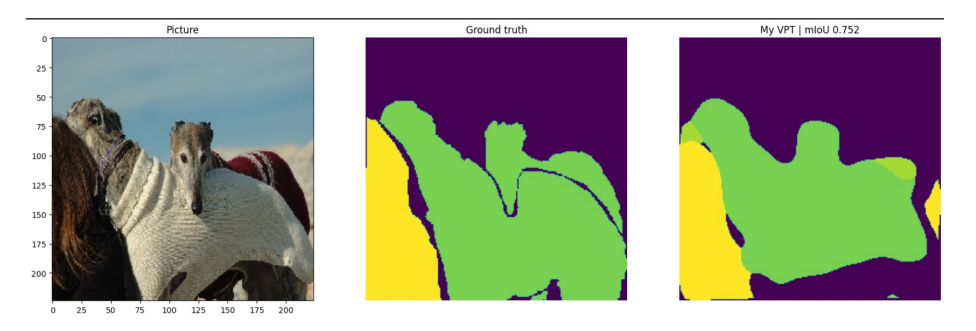

## Segmentation Using VPT

  

## Overview

In this project, a segmentation model was created by applying the [Visual Prompt Tuning](https://arxiv.org/abs/2203.12119) (ECCV 2022). Classification tasks are mainly performed in the existing VPT paper, but I deleted the classification head and added a new head for segmentation. (According to the existing VPT paper, it seems that the segmentation was also experimented with, but it is not specifically described.)

A task specific head was created using the Upsampling CNN structure introduced by [TransUNet](https://arxiv.org/abs/2102.04306), and [PASCAL VOC2012](http://host.robots.ox.ac.uk/pascal/VOC/voc2012/) was used as a dataset.

## Results

As a result, segmentation was possible using about **0.78%** of the parameters of the existing model

• **Best Performance : mIoU 58.7%**

• ViT_base_patch16_224 , deep , batch = 32, prompt_token = 5

• Max lr = 0.001, epoch = 32, weight_decay = 0.0001

• For training : Cross Entropy, AdamW, OneCycleLR

Below are the example segmentated imgs for various images. Although the result was far below [SOTA](https://paperswithcode.com/sota/semantic-segmentation-on-pascal-voc-2012-val), I was able to study by understanding the structure of VPT more closely, and I learned a lot in the process of changing the head and pre-processing the dataset!

  

  

  

  

